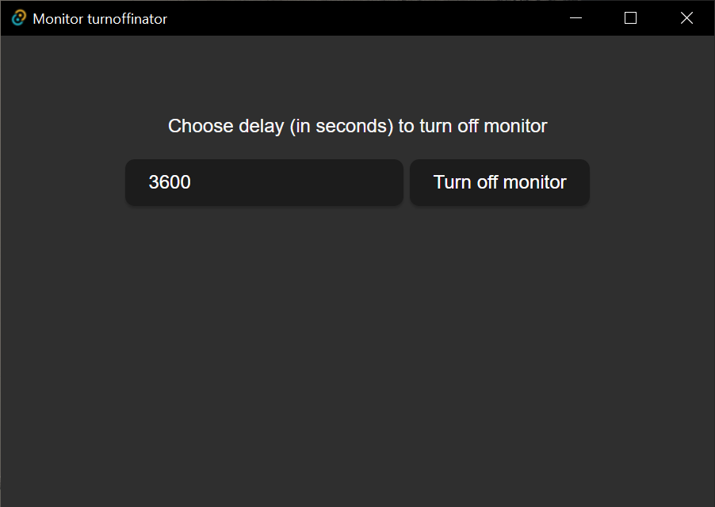

# Monitor turnoffinator

A simple gui app that turns off your monitor after a set delay. Windows only. (Tested on windows 10)

Warning: This is beta software (that will never be properly finished). It might have bugs and there are no guarantees of it being safe or functional. Use at own risk.

# Dev infos

This project was created with the Tauri + React + Typescript template.

It leverages "nircmd", an application created by NirSoft. It is a small command-line utility that allows you to do some useful tasks on windows OS. If you do not trust the .exe provided here, you can download your own directly from NirSoft, replace the one in here and compile the program with it. Alternatively, if you don't want to compile yourself, you can just replace the .exe generated in your installation folder after installing.

By creating the config `"resources": ["resources/*"]`, we bundle the nircmd app into the install folder.

Warning: Don't use the Rust code as reference, it's probably hacky and poorly made. It was a quick solution and my first experience with Rust.

### Recommended IDE Setup

- [VS Code](https://code.visualstudio.com/) + [Tauri](https://marketplace.visualstudio.com/items?itemName=tauri-apps.tauri-vscode) + [rust-analyzer](https://marketplace.visualstudio.com/items?itemName=rust-lang.rust-analyzer)
